# 一、导言
人体骨骼关键点对于描述**人体姿态**,预测**人体行为**至关重要.因此人体骨骼关键点检测是诸多计算机视觉任务的基础,例如**动作分类**,**异常行为检测**,以及**自动驾驶**等等. 近年来, 随着深度学习技术的发展, 人体骨骼点检测效果不断提升, 已经开始广泛应用于计算机视觉的相关领域. 本文主要介绍2D人体骨骼关键点的基本概念和相关算法, 其中算法部分主要着重介绍基于深度学习的人体骨骼关键点检测算法的两个方向, 即**自上而下(Top-Down)**的检测方法和**自下而上(Bottom-Up)**的检测方法.

# 二、相关概念介绍
## 2.1 什么是人体骨骼关键点检测
人体骨骼关键点检测(Pose Estimation), 又称姿态检测或姿态评估, 主要是检测人体的一些关键点, 如关节, 五官等. 通过关键点描述人体骨骼信息;

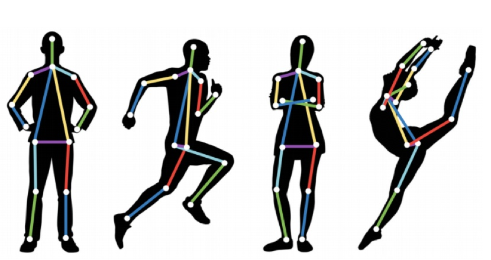

以目前OpenPose项目中比较常用的18关键点为例, 主要检测了:

- 0,  "Nose"(鼻子)
- 1,  "Neck"(脖子)
- 2,  "RShoulder"(右肩)
- 3,  "RElbow"(右肘)
- 4,  "RWrist"(右腕)
- 5,  "LShoulder"(左肩)
- 6,  "LElbow"(左肘)
- 7,  "LWrist"(左腕)
- 8,  "RHip"(右臀)
- 9,  "RKnee"(右膝)
- 10, "RAnkle"(右踝)
- 11, "LHip"(左臀)
- 12, "LKnee"(左膝)
- 13, "LAnkle"(左踝)
- 14, "REye"(右眼)
- 15, "LEye"(左眼)
- 16, "REar"(右耳)
- 17, "LEar"(左耳)

## 2.2 关键点检测的应用与挑战
### 2.2.1 应用
人体骨骼关键点检测是计算机视觉的基础性算法之一, 在计算机视觉的其他相关领域的研究中都起到了**基础性**的作用, 如**行为识别**、**人物跟踪**、**步态识别**等相关领域. 具体应用主要集中在:

- 智能视频监控
- 病人监护系统
- 人机交互
- 虚拟现实
- 人体动画
- 智能家居
- 智能安防
- 运动员辅助训练等等.

### 2.2.2 挑战
由于**人体具有相当的柔性**, 会出现各种姿态和形状, 人体任何一个部位的微小变化都会产生一种新的姿态, 同时其关键点的可见性受穿着、姿态、视角等影响非常大, 而且还面临着遮挡、光照、雾等环境的影响, 除此之外, **2D人体关键点和3D人体关键点在视觉上会有明显的差异**, 身体不同部位都会有视觉上缩短的效果(foreshortening), 使得人体骨骼关键点检测成为计算机视觉领域中一个极具挑战性的课题.

## 2.3 相关的数据集
### [LSP(Leeds Sports Pose Dataset)](http://sam.johnson.io/research/lsp.html)
- 类型: 单人人体关键点检测数据集
- 关键点个数: 14
- 样本数量: 2K
- 使用状态: 在目前的研究中基本上被弃用

### [FLIC(Frames Labeled In Cinema)](https://bensapp.github.io/flic-dataset.html)
- 类型: 单人人体关键点检测数据集
- 关键点个数: 9
- 样本数量: 2W
- 使用状态: 在目前的研究中基本上被弃用

### [MPII(MPII Human Pose Dataset)](http://human-pose.mpi-inf.mpg.de/)
- 类型: 单人/多人人体关键点检测数据集
- 关键点个数: 16
- 样本数量: 25K
- 使用状态: 广泛使用

### [MSCOCO(Microsoft Common Objects in COntext)](http://cocodataset.org/#home)
- 类型: 多人人体关键点检测数据集
- 关键点个数: 17
- 样本数量: >=30W
- 使用状态: 目前的相关研究基本上需要在该数据集上进行验证

### [AI Challenger](https://challenger.ai/competition/keypoint/subject)
- 类型: 多人人体关键点检测数据集
- 关键点个数: 14
- 样本数量: 38W
- 使用状态: 一般用作竞赛数据集

### [PoseTrack](https://posetrack.net/)
- 类型: 多人人体关键点跟踪数据集, 包含单帧关键点检测、多帧关键点检测、多人关键点跟踪
- 关键点个数: 15
- 样本数量: 多于500个视频序列,帧数超过20K
- 使用状态: 目前最新的关于人体骨骼关键点的数据集

## 2.4 传统算法概述
传统的人体骨骼关键点检测算法基本上都是在几何先验的基础上基于模板匹配的思路来进行, 那么核心就在于**如何去用模版表示整个人体结构**, 包括关键点的表示, 肢体结构的表示以及不同肢体结构之间的关系的表示. 一个好的模板匹配的思路,可以模拟更多的姿态范围, 以至于能够更好地匹配并检测出对应的人体姿态.

**Pictorial Structure**是其中一个较为经典的算法思路, 主要包含两个部分, 其一是**单元模板(Unary Templates)**, 其二是**模板关系(Pairwise Springs)**. 对于模板关系, 提出了著名的弹簧形变模型, 弹簧形变模型, 即对部件模型与整体模型的相对空间位置关系进行建模, 利用了物体的一些**空间先验知识**, 既合理约束了整体模型和部件模型的空间相对位置, 又保持了一定的灵活性.

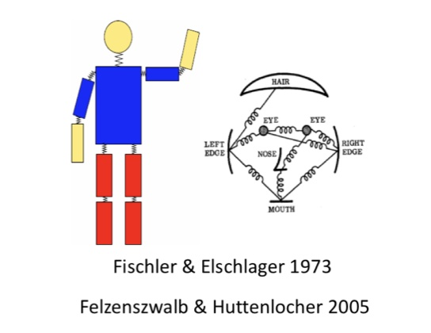 

为了匹配更大的姿态范围, Yang & Ramanan提出了“mini parts”的概念, 即将每个肢体结构(part)切分成更小的parts以能够模拟更多的姿态变化, 从而提高模版匹配的效果, 具体示意图如下图所示.

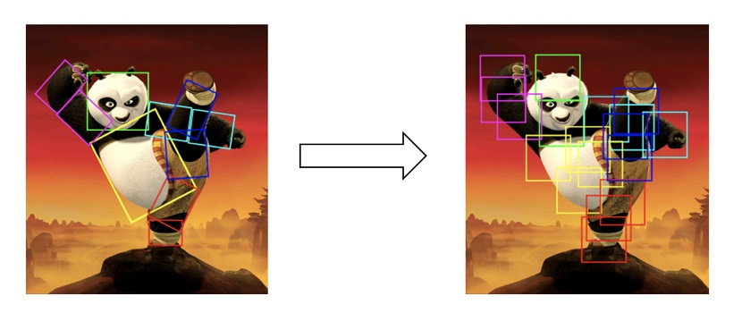

# 三、人体骨骼关键点检测
## 3.1 算法概述
多人人体骨骼关键点检测主要有两个方向, 一种是**自上而下**, 一种是**自下而上**.
其中自上而上的人体骨骼关键点定位算法主要包含两个部分:

- 人体检测
- 单人人体关键点检测

该类算法的主要思想是: **首先通过目标检测算法将每一个人检测出来, 然后在检测框的基础上针对单个人做人体骨骼关键点检测**.
其中代表性算法有: **G-RMI**, **CFN**, **RMPE**, **Mask R-CNN**, and **CPN**, 目前在MSCOCO数据集上最好的效果是72.6%;

自下而上的方法也包含两个部分:

- 关键点检测
- 关键点聚类

该算法主要思想是: **首先需要将图片中所有的关键点都检测出来,然后通过相关策略将所有的关键点聚类成不同的个体**
其中对关键点之间关系进行建模的代表性算法有: **PAF**, **Associative Embedding**, **Part Segmentation**, **Mid-Range offsets**, 目前在MSCOCO数据集上最好的效果是68.7%.

## 3.2 Coordinate、Heatmap两个概念
在介绍多人人体骨骼关键点检测算法之前, 首先介绍一下关键点回归的Ground Truth的构建问题, 主要有两种思路:

- Coordinate
- Heatmap

Coordinate就是直接将**关键点坐标**作为最后网络需要回归的目标, 这种情况下可以直接得到每个坐标点的直接位置信息; Heatmap即将每一类坐标用一个概率图来表示, 对图片中的每个像素位置都给一个概率, 表示该点属于对应类别关键点的概率. 比较自然的是, 距离关键点位置越近的像素点的概率越接近1; 距离关键点越远的像素点的概率越接近0. 具体可以通过相应函数进行模拟, 如Gaussian等. 如果同一个像素位置距离不同关键点的距离大小不同, 即相对于不同关键点该位置的概率不一样, 这时可以取Max或Average,如下图所示.

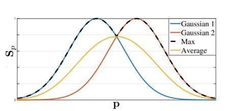

对比两种Ground Truth的差别: 

- Coordinate网络在**本质上**来说, 需要回归的是**每个关键点的一个相对于图片的offset**, 而长距离offset在实际学习过程中是很难回归的, **误差较大**, 同时在训练的过程中,提供的监督信息较少,整个网络的**收敛速度较慢**;
- Heatmap网络直接回归出**每一类关键点的概率**, 在一定程度上每一个点都提供了监督信息, 网络能够**较快地收敛**, 同时对每一个像素位置进行预测能够**提高关键点的定位精度**. 在可视化方面, Heatmap也要优于Coordinate. 除此之外, 实践证明, Heatmap确实要远优于Coordinate, 具体结构如下图所示.

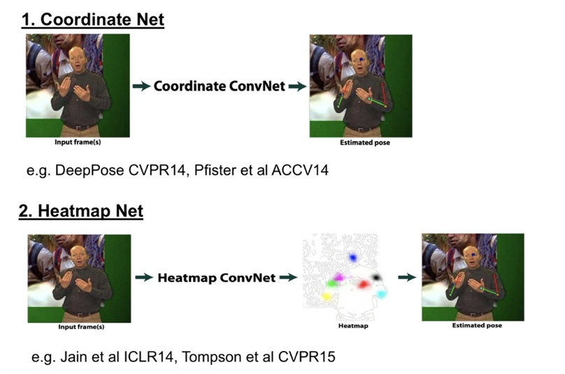

## 3.3 自上而下的人体关键点检测算法

自上而下(Top-Down)的人体骨骼关键点检测算法主要包含两个部分, 目标检测和单人人体骨骼关键点检测.

### 3.3.1 目标检测的主要方法(不详细说): 
- 一步法(One Stage): RCNN ---> SPPNet ---> Fast RCNN ---> Faster RCNN ---> R-FCN
- 两步法(Two Stage): YOLOv1 ---> SSD ---> YOLOv2 ---> YOLOv3

### 3.3..2 单人关键点检测算法需要注意的问题:
- 首先需要注意的是关键点局部信息的区分性很弱, 即背景中很容易会出现同样的局部区域造成混淆, 所以需要考虑较大的感受野区域;
- 其次人体不同关键点的检测的难易程度是不一样的, 对于腰部、腿部这类关键点的检测要明显难于头部附近关键点的检测, 所以不同的关键点可能需要区别对待;
- 最后自上而下的人体关键点定位依赖于检测算法的提出的Proposals, 会出现检测不准和重复检测等现象, 大部分相关研究都是基于这三个特征去进行相关改进.

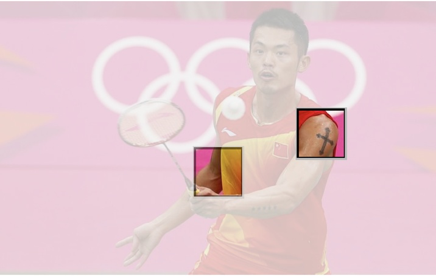

### 3.3.3 单人关键点常用检测算法:
- Convolutional Pose Machines
此结构将深度学习应用于人体姿态分析, 同时用卷积图层表达纹理信息和空间信息. 主要网络结构分为多个stage, 其中第一个stage会产生初步的关键点的检测效果, 接下来的几个stage均以前一个stage的预测输出和从原图提取的特征作为输入, 进一步提高关键点的检测效果. 具体的流程图如下图所示.

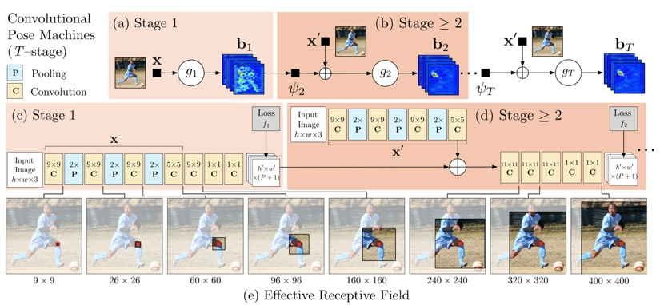

用各部件响应图来表达各部件之间的空间约束, 响应图和特征图一起作为数据在网络中传递. 人体关键点在空间上的先验分布会指导网络的学习, 假如stage 1的预测结果中右肩关键点的预测结果是正确的, 而右肘关键点的预测是错误的, 那么在接下来的stage中肩和肘在空间上的先验分布会指导网络的学习. 如下图所示.

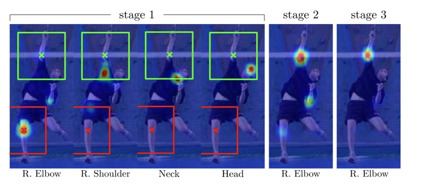

除此之外, 使用多阶段监督, 对于各个阶段的预测输出都有监督训练, 避免过深网络难以优化的问题, 而且感受野随着stage的增多而逐渐增大, 最后值得一提的是第一阶段对原图提取特征的网络区别于stage > 1的特征提取网络, 因为第一个阶段网络的作用是预测初步的结果, 而后几个阶段的作用是结合关键点空间先验知识和对原图提取的特征对上一个stage预测的结果做进一步精化.

- Cascaded Pyramid Network
此结构主要关注的是不同类别关键点的检测难度是不一样的, 整个结构的思路是先检测比较简单的关键点、然后检测较难的关键点、最后检测更难的或不可见的关键点. 具体Pipeline如下图所示.

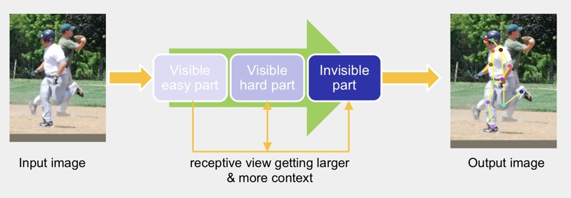

具体实现时, 分为两个stage, GlobalNet和RefineNet. 其中GlobalNet主要负责检测容易检测和较难检测的关键点. 对于较难关键点的检测, 主要体现在网络的较深层, 通过进一步更高层的语义信息来解决较难检测的关键点问题; RefineNet主要解决更难或者不可见关键点的检测. 这里对关键点难易程度进行界定主要体现在关键点的训练损失上, 使用了常见的Hard Negative Mining策略, 在训练时取损失较大的top-K个关键点计算损失, 然后进行梯度更新, 不考虑损失较小的关键点. 网络结构如下图所示.

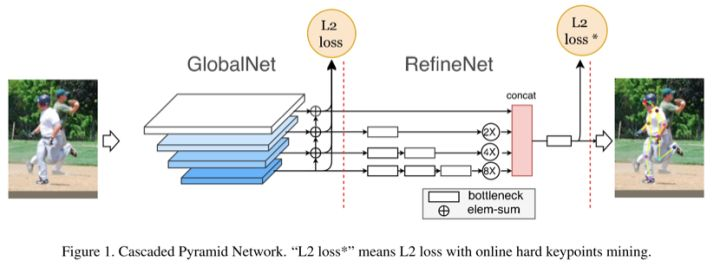

- RPME
此结构主要考虑的是自上而下的关键点检测算法在目标检测产生Proposals的过程中, 可能会出现检测框定位误差、对同一个物体重复检测等问题. 检测框定位误差, 会出现裁剪出来的区域没有包含整个人或者目标人体在框内的比例较小, 造成接下来的单人人体骨骼关键点检测错误; 对同一个物体重复检测, 虽然目标人体是一样的, 但是由于裁剪区域的差异可能会造成对同一个人会生成不同的关键点定位结果. 此结构提出了一种方法来解决目标检测产生的Proposals所存在的问题, 即通过空间变换网络将同一个人体的产生的不同裁剪区域（Proposals）都变换到一个较好的结果, 如人体在裁剪区域的正中央, 这样就不会产生对于一个人体的产生的不同Proposals有不同关键点检测效果. 具体Pipeline如下图所示:

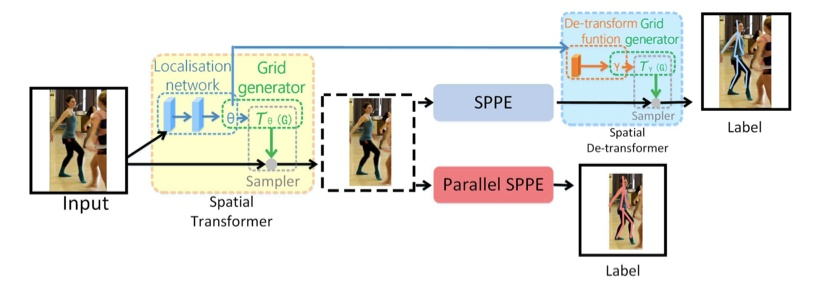

### 3.3.4 自上而下方法的优缺点
- 优点: 思路直观, 自然, 被绝大部分人所青睐, 且单人估计精度非常高.
- 缺点: 检测精度受到单人检测器的影响, 如果单人检测不准确, 那么其后的关键点检测也将不准确; 检测速度随场景中人数的增多而下降.

## 3.4 自下而上的人体关键点检测算法

自下而上（Bottom-Up）的人体骨骼关键点检测算法主要包含两个部分, 关键点检测和关键点聚类. 

### 3.4.1 关键点检测
关键点检测**和单人的关键点检测方法上是差不多**的, 所以在这里不做过多介绍. 区别在于这里的关键点检测需要将图片中所有类别的所有关键点全部检测出来.

### 3.4.2 关键点聚类
上一步关键点检测出来之后, 就开始对这些关键点进行聚类处理, 将不同人的不同关键点连接在一块, 从而聚类产生不同的个体. 自下而上这类方法主要侧重于对关键点聚类方法的探索, 即如何去构建不同关键点之间的关系, 接下来将介绍几种经典的方法.

- Part Segmentation
即对人体进行不同部位分割, 而关键点都落在分割区域的特定位置, 通过部位分割对关键点之间的关系进行建模, 既可以显式的提供人体关键点的空间先验知识, 指导网络的学习, 同时在最后对不同人体关键点进行聚类时也能起到相应的连接关键点的作用. 如下图所示.

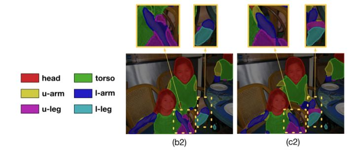

- Part Affinity Fields

该方法通过对人体的不同肢体结构进行建模, 使用向量场来模拟不同肢体结构, 解决了单纯使用中间点是否在肢干上造成的错连问题.

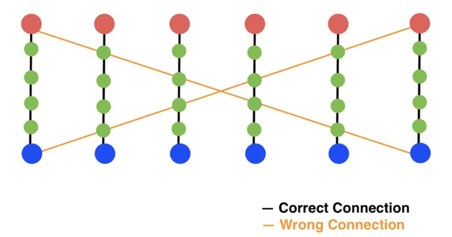

如上图所示, 如果只使用中间点对肢干进行建模, 中间点都在对应的肢干上, 则判断两个关键点处在该肢干的两端, 这样就会出现如上图所示的错连情况. 而PAFs则不仅使用中间点来建模肢干, 而且在中间的位置之外还给每个中间点加上了方向的信息, 这样就能解决出现的错连问题. 具体如下图所示.

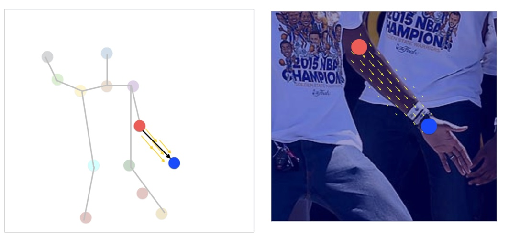

- Associative Embedding

该方法通过使用高维空间的向量来编码不同人体的不同关键点之间的关系, 即同一个人的不同关键点在空间上是尽可能接近的, 不同人的不同关键点在空间上是尽可能远离的, 最后可以通过两个关键点在高维空间上的距离来判断两个关键点是否属于同一个人, 从而达到聚类的目的. 如下图所示.

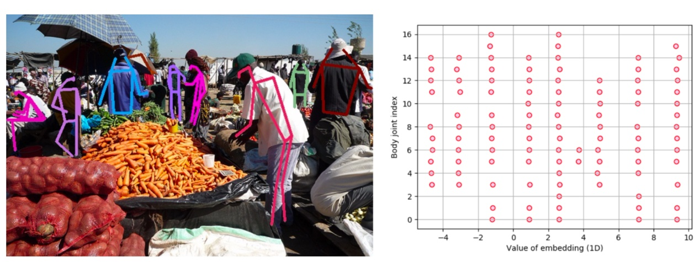

- Mid-Range Offsets

该方法通过直接回归一个关键点到另一个关键点之间的offset来建模两个关键点之间的关系, 这种较长距离的offsets是较难学习的, 在回归具体数值时会有较大误差, 这里可以用关键点周围的Short-Range Offsets去进一步Refine对应的offsets. 具体如下图所示.

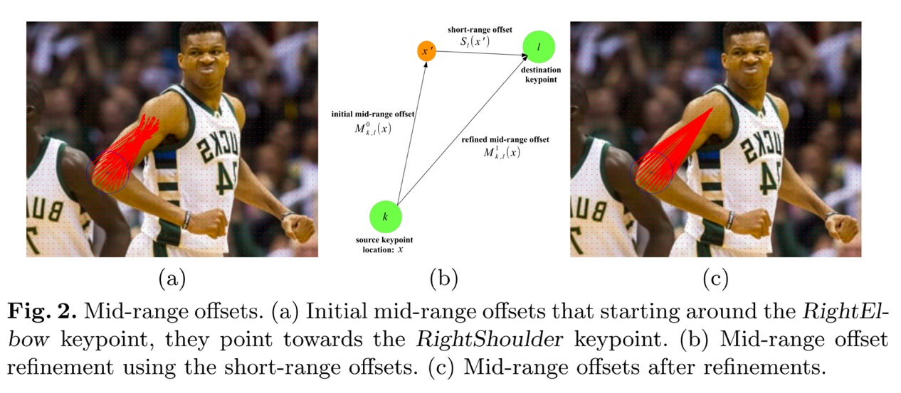

### 3.4.3 自下而上方法的优缺点
- 优点: 检测速度不受场景中人数的影响.
- 缺点: 检测效果相较于自上而下要低.

# 四、小结
人体骨骼关键点定位至今仍然是计算机视觉领域较为活跃的一个研究方向, 人体骨骼关键点检测算法还没有达到比较完美的效果, 在较为复杂的场景下仍然会出现很多错误的检测结果. 自上而下的关键点检测算法在效果上要明显好于自下而上的关键点检测算法, 因为自上而下的检测方法加入了整个人体的一个空间先验. 自下而上的关键点定位算法没有显示的去建模整个人体的空间关系, 而只是建模了局部的空间关系, 以至于在效果上目前还远低于自上而上的关键点检测方法.

